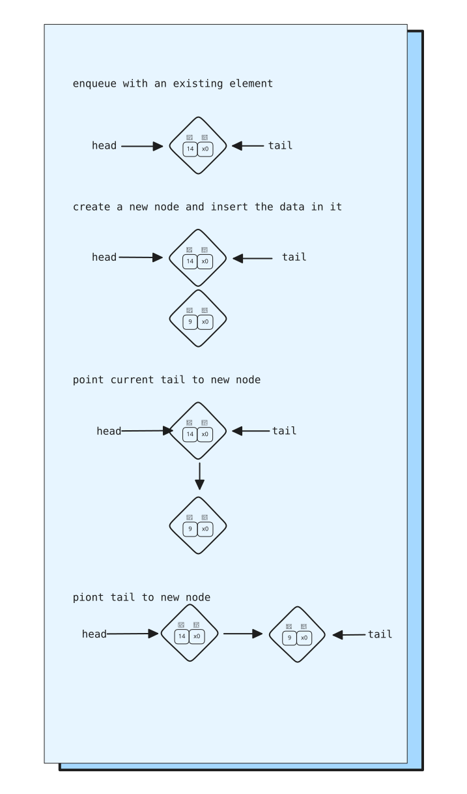
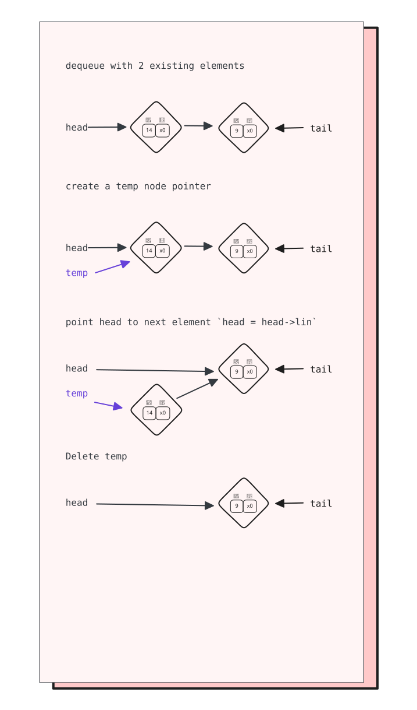

* [ ] Implement the following date structures
  * [ ] Priority Queues
  * [ ] Binary Search Tree
  * [ ] Graphs
* [ ] Have a User menu with
  * [ ] Add
  * [ ] Edit
  * [ ] Delete
  * [ ] Print (read)
  * [ ] Serach
  * [ ] exit
* [ ] Must be file-based (data is read from and written to a file)
* [ ] Slides
  * [ ] intro
  * [ ] flowchart
  * [ ] the data strucures used and why
  * [ ] running the code?
* [ ] Submission
  * [ ] code files
  * [ ] output screenshots
  * [ ] slides

## Normal Queue implmentation
We implment 2 main methods `enqueue()` for adding an item to the end of the queue (tail, rear...)
and `dequeue()` to remove the (head, front...) item from the queue

| Enqueue | Dequeue |
| --- | --- |
|  |  |
